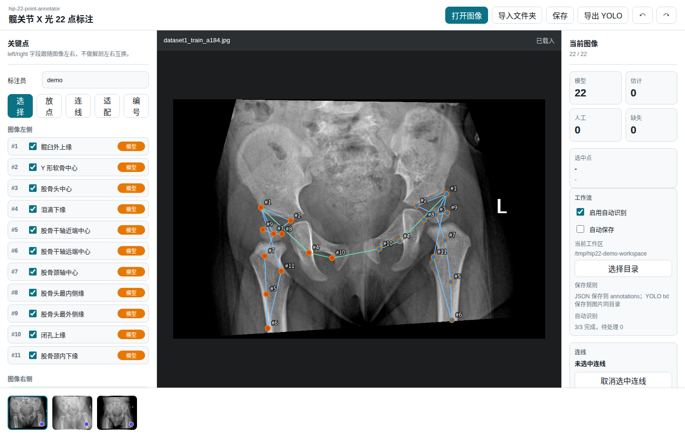
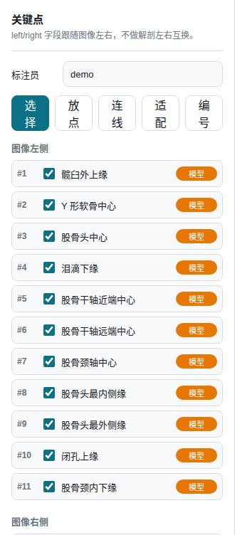
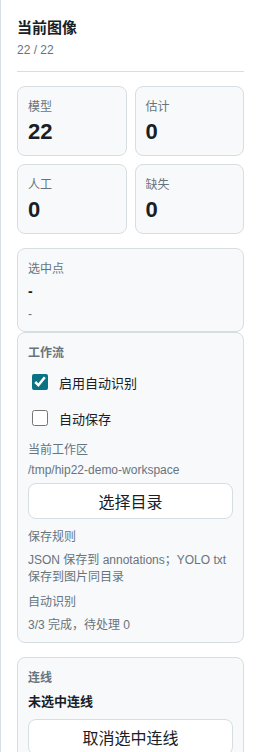

# Hip 22-Point Annotation Tool

FastAPI + Canvas web tool for reviewing and editing 22 hip X-ray landmarks, with optional model-assisted initialization.

This project is a research annotation aid. It is not a medical device, does not provide diagnosis, and should not be used as a standalone clinical decision system. All automatically generated points should be reviewed and corrected by a qualified user before downstream use.



## What It Does

- Annotates 22 landmarks: image-left and image-right, each with hospital points #1-#11.
- Loads a local image folder as a workspace.
- Supports common image files plus single-frame grayscale DICOM (`.dcm`, `.dicom`, and extensionless DICOM with a valid header).
- Renders DICOM to Canvas without writing derived PNG files into the submitted folder, and stores PixelSpacing metadata without PHI fields.
- Preserves existing JSON or YOLO sidecar labels and never overwrites reviewed annotations during auto-detection.
- Uses the bundled `models/yolo11n-best.pt` weight by default for model-assisted initialization.
- Provides an `Auto Detect` button for retrying the current image without discarding manual corrections.
- Provides an enhanced preview and enhanced auto-detect retry based on the hip_demo-style X-ray contrast pipeline.
- Opens images in enhanced view by default, with a one-click original-image comparison.
- Caches enhanced/DICOM display PNGs under local app data so repeated image switching does not recompute enhancement every time.
- Adds draggable template guesses when model output is missing or incomplete, so reviewers do not start from an empty canvas.
- Supports a non-destructive ROI crop box for cluttered-background images; recognition can retry inside the ROI while saved coordinates remain in the original image coordinate system.
- Supports a four-corner scan-like transform for phone-shot X-rays; current-image recognition can run on the perspective-corrected view and map points back to original coordinates.
- Writes visible workspace progress files so a folder can show which images are unfinished, auto-initialized, in progress, or complete.
- Saves complete annotation JSON to `annotations/<image_stem>.json`.
- Saves YOLO Pose sidecar labels to `<image_stem>.txt` beside each image.
- Supports zoom, pan, drag-to-correct, missing-point marking, undo/redo, manual connections, Shenton curve collection, and keyboard image navigation.

The bundled yolo11n-best weight is trained from manually created research annotations on MTDDH-derived images by a non-medical annotator; users should review and correct all outputs before use.

## Demo Screenshots

Demo screenshots use pelvic X-ray examples derived from the MTDDH dataset, licensed under CC BY 4.0; see Qi et al., Scientific Data, 2025. The original MTDDH image dataset is not redistributed in this repository.

| Workspace | Point Review | Export |
|---|---|---|
|  |  |  |

## Download For Hospital Use

Hospital users should download the Windows CPU ZIP from [GitHub Releases](https://github.com/wzxsph/hip-22-annotation-tool/releases), unzip it locally, and run `Hip22AnnotationTool.exe` or `Run-Hip22.bat`.

Do not use GitHub's `Code > Download ZIP` for hospital delivery. GitHub source ZIP downloads do not reliably include Git LFS model binaries, so `models/yolo11n-best.pt` may be missing or replaced by a small pointer file. In that state the app can still open, but model-assisted initialization will report that the model is unavailable.

For developers cloning the repository, install Git LFS before or immediately after cloning:

```bash
git lfs install
git clone https://github.com/wzxsph/hip-22-annotation-tool.git
cd hip-22-annotation-tool
git lfs pull
```

To verify that the model is present, `models/yolo11n-best.pt` should be a large binary file, not a tiny text file beginning with `version https://git-lfs.github.com/spec/v1`.

## Install

Python 3.10-3.12 is recommended. The bundled model uses the `ultralytics` package for inference.

```bash
git clone https://github.com/wzxsph/hip-22-annotation-tool.git
cd hip-22-annotation-tool

uv venv --python python3.12
source .venv/bin/activate
uv pip install -r requirements-dev.txt
uv run pytest
```

Start the local server:

```bash
uv run uvicorn annotation_tool.server:app --host 127.0.0.1 --port 8010
```

Open `http://127.0.0.1:8010/`.

## Windows Hospital Package

For hospital delivery, build the CPU-only Windows ZIP on a Windows machine with Python 3.10-3.12:

```powershell
powershell -ExecutionPolicy Bypass -File .\scripts\build_windows_cpu.ps1
powershell -ExecutionPolicy Bypass -File .\scripts\package_zip.ps1 -SkipBuild
powershell -ExecutionPolicy Bypass -File .\dist\smoke_test.ps1
```

Share only the ZIP after the smoke test passes. See:

- [Windows CPU build notes](docs/windows-cpu-build.md)
- [Windows ZIP distribution](docs/windows-zip-distribution.md)
- [Chinese hospital user guide](docs/hospital-user-guide.md)
- [Demo video script](docs/demo-video-script.md)
- [Internal data preparation](docs/internal-data-prep.md)

## Model Setup

Default model path:

```text
models/yolo11n-best.pt
```

You can override it:

```bash
HIP22_MODEL_PATH=/absolute/path/to/model.pt \
uv run uvicorn annotation_tool.server:app --host 127.0.0.1 --port 8010
```

Device selection:

- `HIP22_DEVICE=auto` or unset: use `cuda:0` when PyTorch reports CUDA is available; otherwise use CPU.
- `HIP22_DEVICE=cpu`: force CPU inference.
- `HIP22_DEVICE=cuda:0`: force a specific GPU.

If the model file is missing or `ultralytics` is unavailable, the tool still opens images and creates low-confidence draggable template guesses with a visible warning instead of returning an internal server error.

## DICOM, Enhanced Preview, And Shenton Prototype

Version 0.2.0 adds prerelease research support for DICOM and Shenton curve collection:

- DICOM import reads `PixelSpacing` / `ImagerPixelSpacing`, applies rescale slope/intercept, window center/width, and `MONOCHROME1` inversion. Unsupported compressed/private formats are reported as warnings instead of stopping the whole folder import.
- The annotation JSON stores non-PHI image metadata only: `source_format`, pixel spacing fields, spacing source, and DICOM warnings. It does not store `PatientName`, `PatientID`, `AccessionNumber`, or similar identifiers.
- The UI opens in `Enhanced` viewing by default and can switch back to `Original` for comparison. Enhanced view uses grayscale percentile stretch, `autocontrast(cutoff=0.5)`, and histogram equalization for easier boundary review. It does not change coordinates or overwrite the source image.
- Folder import queues model-assisted initialization with enhanced preprocessing by default; `Enhanced Detect` uses the same preprocessing path for current-image retries.
- If a reviewer draws an ROI crop, current-image auto-detect retries inside that ROI and maps detected points back to the original image coordinates.
- If a reviewer marks four scan corners, current-image auto-detect first warps the image into a scan-like view, then maps detected points back to the original image coordinates. This is intended for phone-shot images with visible film borders.
- If model output is unavailable or incomplete, missing points are filled with `template_guess` points from a normalized demo-derived template. These are starting positions only and require review.
- Default 22-point guide connections are hidden by default to reduce occlusion. Manual connections, Shenton curves, measurement lines, and point labels each have separate display toggles.
- The Shenton tool lets a reviewer mark left/right obturator upper curve and femoral-neck inner-lower curve with at least 3 points per segment; more points are allowed for curve fitting. The measurement snapshot reports both endpoint gap and forward-extension gap. Measurements are research aids only, not clinical conclusions.
- `/api/annotation/measurements/compute` returns Shenton `gap_px`, optional `gap_mm`, tangent angle, AI/Tonnis angle, Sharp angle, CE angle, neck-shaft angle, acetabular depth, and warnings. Acetabular depth is shown in mm when DICOM PixelSpacing is available.

Internal research export:

```bash
uv run python scripts/export_shenton_training_set.py --workspace /path/to/workspace --output /path/to/out --overwrite
uv run python scripts/prepare_scan_like_images.py --input /path/to/raw-phone-photos --output /path/to/clean-scan-like --overwrite
```

The script writes `shenton_curves.jsonl` and a YOLO pose dataset with two classes: `obturator_shenton_arc` and `femoral_neck_shenton_arc`, each resampled to four control points.
The scan-like preparation script writes enhanced perspective-corrected images plus `scan_like_mapping.csv` and `scan_like_report.json`; use it only for local/internal data organization unless image permissions are confirmed.

## Workspace Layout

Importing a folder makes that folder the current workspace. The tool may create these files in that folder:

```text
workspace/
├── data.yaml
├── manifest.json
├── <image_stem>.txt
├── annotations/
│   └── <image_stem>.json
└── splits/
    └── train_val_split.json
```

Existing data priority:

1. `annotations/<image_stem>.json`
2. same-folder `<image_stem>.txt`
3. model-assisted initialization with template fallback when needed

Existing JSON and imported sidecar labels are treated as user data and are not overwritten by auto-detection.

For DICOM images, the submitted folder still contains the original DICOM file plus generated annotation JSON/TXT. The app renders PNG dynamically only for browser display.

The workspace may also contain generated progress/submission helpers: `HIP22_STATUS_DONE_<n>_TODO_<m>.txt`, `HIP22_status_report.html`, `HIP22_status_report.csv`, and `HIP22_SUBMISSION_README.txt`.

### Annotation JSON Storage

All point, Shenton, ROI, scan-transform, measurement, and DICOM-display coordinates are stored in original image pixel coordinates. Enhanced preview, ROI detection, scan-like recognition, and DICOM PNG rendering must never change the saved annotation coordinate system.

Important fields:

- `image`: filename, dimensions, split, source format, pixel spacing fields, DICOM warnings, and side convention. DICOM PHI fields such as patient name, patient ID, accession number, and birth date are not saved.
- `keypoints`: the fixed 22-key schema. `source="pose11_side"` means model output; `source="template_guess"` means a low-confidence draggable fallback point; `source="manual"` means the reviewer moved or placed the point.
- `roi_crop`: optional non-destructive crop box with `enabled`, `x`, `y`, `width`, `height`, `source`, `updated_at`, and `annotator`.
- `scan_transform`: optional non-destructive four-corner transform with `enabled`, `corners`, `mode`, `source`, `updated_at`, and `annotator`.
- `shenton_curves` and `shenton_review`: left/right Shenton curve point lists and doctor review status.
- `measurements_snapshot`: computed research-aid measurements such as Shenton gap, AI/Tonnis angle, Sharp angle, CE angle, neck-shaft angle, and acetabular depth with optional pixel-spacing conversion.
- `auto_initialization`: model source, fallback attempts, preprocessing label, ROI/scan transform used for retry, original model visible count, warnings, and `template_fallback` metadata.

## Landmark Schema

Each image stores 22 keypoints. `left_*` means image-left and `right_*` means image-right; there is no anatomical left/right swap.

| # | Field | Chinese label |
|---|---|---|
| 1 | `acetabular_outer` | 髋臼外上缘 |
| 2 | `triradiate_center` | Y 形软骨中心 |
| 3 | `femoral_head_center` | 股骨头中心 |
| 4 | `teardrop_lower` | 泪滴下缘 |
| 5 | `femoral_shaft_prox` | 股骨干轴近端中心 |
| 6 | `femoral_shaft_dist` | 股骨干轴远端中心 |
| 7 | `femoral_neck_axis_center` | 股骨颈轴中心 |
| 8 | `femoral_head_medial` | 股骨头最内侧缘 |
| 9 | `femoral_head_lateral` | 股骨头最外侧缘 |
| 10 | `obturator_upper` | 闭孔上缘 |
| 11 | `femoral_neck_inner_lower` | 股骨颈内下缘 |

Missing points are represented explicitly:

```json
{
  "x": null,
  "y": null,
  "visible": false,
  "visibility": 0,
  "source": "missing"
}
```

The UI treats a point as visible only when `visible = true`, `visibility > 0`, and both `x` and `y` are present. Source strings do not determine missingness.

## Controls

| Action | Control |
|---|---|
| Drag point | Move and mark as manual |
| Right-click canvas | Quickly place selected point |
| Mouse wheel | Zoom |
| Space + drag | Pan |
| Fit / `F` | Recenter and scale the current image to the canvas; in ROI/scan mode it fits the ROI or scan region when available |
| `←` / `→` | Previous / next image |
| `Delete` | Mark selected point missing, or hide/delete selected connection |
| `Ctrl+S` | Save |
| `Ctrl+Z` / `Ctrl+Y` | Undo / redo |
| `V` / `P` / `R` / `C` / `S` | Select / point / ROI / scan-corner / Shenton mode |
| `E` | Toggle enhanced/original view |
| `D` | Auto-detect current image |
| `F` | Fit image, fit ROI while using the ROI tool, or fit the scan region while using the scan tool |
| `?` | Show keyboard shortcuts |
| `H` | Toggle point labels |

## YOLO Pose Label Format

The tool saves one same-folder `.txt` per image. Each file has 11 rows:

```text
class_id cx cy w h left_x left_y left_vis right_x right_y right_vis
```

Rules:

- `class_id` is #1-#11 in zero-based order.
- Coordinates are normalized to `[0, 1]`.
- Visible points use `vis=2`.
- Missing points use `0 0 0`.
- `data.yaml` uses `kpt_shape: [2, 3]` and `flip_idx: [1, 0]`.

## License and Attribution

This repository is distributed under GNU AGPL-3.0. The bundled model weight is derived from the Ultralytics YOLO model family and is distributed with this repository under AGPL-3.0. For closed-source or commercial embedded use, review the Ultralytics license terms and obtain the appropriate license if needed.

MTDDH attribution:

> Demo screenshots use pelvic X-ray examples derived from the MTDDH dataset, licensed under CC BY 4.0; see Qi et al., Scientific Data, 2025.

Links:

- Ultralytics license: https://www.ultralytics.com/license
- MTDDH article: https://www.nature.com/articles/s41597-025-05146-x
- CC BY 4.0: https://creativecommons.org/licenses/by/4.0/
- Model details: [MODEL_CARD.md](MODEL_CARD.md)
- Third-party notices: [THIRD_PARTY_NOTICES.md](THIRD_PARTY_NOTICES.md)

## Development Checks

```bash
uv run pytest
uv run python -m compileall annotation_tool
node --check static/app.js
```

Before publishing a public repository, check that runtime data is absent:

```bash
find . -maxdepth 3 \( -name '.venv' -o -name 'manifest.json' -o -name 'tool-settings.json' -o -name 'annotations' -o -name 'images' -o -name 'labels' \) -print
git lfs ls-files
git diff --cached --name-only -- '*.jpg' '*.jpeg' '*.png' '*.bmp' '*.tif' '*.tiff' '*.webp'
```

Windows ZIPs, build folders, local demo images, MTDDH source images, and hospital/private datasets should stay out of git. Attach generated Windows packages to GitHub Releases instead.
